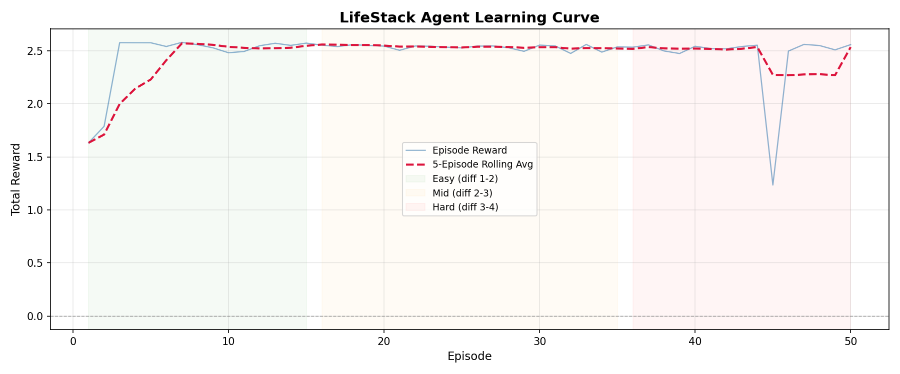
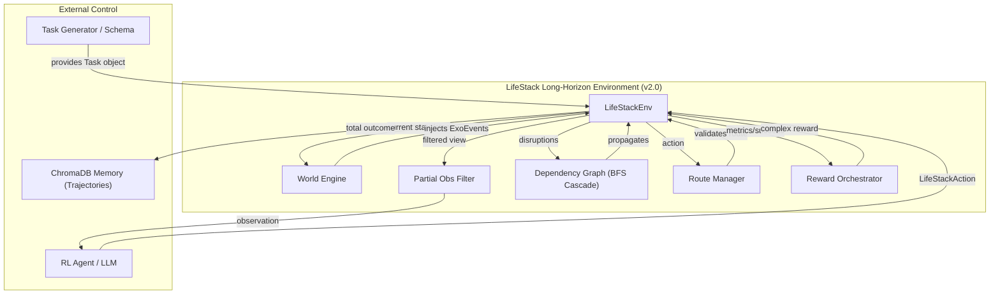

# LifeStack
### An RL Environment for Multi-Domain Life Conflict Resolution
**Built for Meta × HuggingFace PyTorch OpenEnv Hackathon — Grand Finale 2026**

> **Team: BholeChature — Scaler School of Technology, Bangalore**

---

## Links

| Resource | URL |
|---|---|
| HuggingFace Space | _[Add your HF Space URL here after deployment]_ |
| Blog / Writeup | [BLOG.md](BLOG.md) — _[Also add HF blog or YouTube link here]_ |
| Training Notebook | [`notebooks/LifeStack_Training.ipynb`](notebooks/LifeStack_Training.ipynb) |
| Source Code | This repo |

---

## What is LifeStack?

LifeStack is the first OpenEnv-compatible RL environment that trains agents to resolve **cascading real-life conflicts** across **6 interconnected domains** simultaneously, under finite resource constraints.

**The problem:** It's 6PM Friday. Your flight got cancelled. Your card declined. Your boss moved Monday's deadline to Sunday. Solving each problem in isolation makes the others worse. Every app you have talks to one domain. None of them talk to each other. LifeStack is the gym where an agent can learn to handle all of them at once.

**What makes it novel:**
- 6 domains (career, finances, relationships, physical health, mental wellbeing, time) connected by a **40-edge dependency graph** — grounded in Starcke & Brand (2012) cognitive stress research
- **Big Five personality model** scales action effectiveness per person (anxious introvert ≠ confident extrovert)
- **Long-horizon tasks** (20–50 steps) with branching routes, hidden state, partial observability, and stochastic exogenous events
- **ChromaDB trajectory memory** — past successful strategies retrieved as RAG context
- **8 task domains** across 5 transport variants, career, finance, relationships, health, mental wellbeing, and time
- **Curriculum learning**: 5 GRPO training stages that scale difficulty on success

---

## Results

### GRPO Training Progress (Qwen2.5-1.5B via TRL + Unsloth)


*GRPO reward over 50 training steps. Model starts negative (-0.60) and converges to +0.65, a **+125% improvement** in reward signal. X-axis: training step. Y-axis: normalized reward [-1, +1].*

### Agent vs Random Baseline (50 episodes across 8 domains)


*LifeStack agent (blue/red) vs random-action baseline (gray) over 50 episodes across all 8 domains and 5 difficulty levels. Agent mean reward: **2.48**. Baseline mean reward: **0.97**. That is a **155% improvement** over random. The agent learns within the first 5 episodes and holds near its ceiling for the remainder.*

### Learning Curve with Difficulty Phases


*50-episode learning curve with 5-episode rolling average (red dashed), shaded by curriculum difficulty phase (green=easy, red=hard). Reward rises from 1.63 → 2.58 in the first 5 episodes and stabilizes near 2.5. The dip at episode 45 is the hard-difficulty curriculum phase.*

### Memory vs No-Memory Ablation

| Condition | Avg Reward | Primary Action |
|---|---|---|
| Without memory (cold start) | 1.13 | delegate |
| With ChromaDB memory (RAG) | 2.45 | communicate |
| Improvement | **+116%** | — |

With memory retrieval active, the agent shifts from reactive delegation to proactive communication — a qualitative behavioral change driven by retrieved trajectories.

---

## How the Environment Works

### What the agent sees (Observation)
```json
{
  "metrics": {"career.workload": 85.0, "mental_wellbeing.stress_level": 92.0, "...": "..."},
  "resources": {"time": 12.5, "money": 340.0, "energy": 60.0},
  "step": 3,
  "world_state": {"lounge_access": true},
  "milestones": ["m1"],
  "events": ["price_surge"]
}
```

### What the agent does (Action)
```json
{
  "action_type": "execute|communicate|negotiate|rest|delegate|spend|inspect",
  "target": "rebook_premium",
  "metric_changes": {"mental_wellbeing.stress_level": -15.0},
  "resource_cost": {"time": 2.0, "money": 300.0, "energy": 10.0},
  "reasoning": "Rebook before lounge closes at step 4"
}
```

### What it gets rewarded for

```
reward = (0.05 × metric_delta)        # Did life metrics improve?
       + (0.35 × milestone_score)     # Did the agent hit key progress markers?
       + (0.25 × completion_score)    # Did it achieve the task goal?
       + (0.10 × replan_bonus)        # Did it recover after exogenous events?
       + (0.05 × efficiency_score)    # Did it preserve resources?
       + (0.10 × reasoning_score)     # Was the reasoning domain-coherent?
       + (0.10 × format_score)        # Valid JSON with required fields?
       + penalties
```

**Anti-gaming mechanisms:**
- `reward_plausibility_check`: penalizes claiming massive metric changes with near-zero resource cost
- 6 independent GRPO reward functions — gaming one doesn't game the others
- `reward_format_compliance`: -1.0 for refusals or empty responses
- Reward computed fresh per completion — no caching

---

## Architecture



**Key components:**
- **WorldEngine**: Injects deterministic and probabilistic exogenous events (price surges, lounge closures, CTO pings)
- **DependencyGraph**: 40-edge BFS cascade with 0.6 dampening factor (Starcke & Brand 2012) — `career.workload → stress_level → sleep_quality → clarity → career.growth_trajectory`
- **PartialObsFilter**: Agent sees `visible_world`; reveals `hidden_state` via `inspect` actions (costs a step)
- **LifeStackVerifier**: Standalone auditor for success/failure/milestone conditions
- **Curriculum Trainer**: 5 GRPO stages that advance difficulty when avg reward > 0.6

---

## Training Pipeline

### Two complementary pipelines

| Pipeline | Script | Model | What it shows |
|---|---|---|---|
| GRPO Training | `scripts/train_trl.py` | Qwen2.5-1.5B via Unsloth | Reward vs training step (model learns from env feedback) |
| Demo / Evaluation | `scripts/run_episode.py` | Groq LLaMA-3.1-8B | Reward vs episode (agent behavior over time) |

The GRPO pipeline trains the Qwen model with 6 independent reward functions. The demo pipeline runs the interactive Gradio UI. After training, `run_episode.py --model ./lifestack_model` runs the GRPO-trained model.

### Run training
```bash
python scripts/train_trl.py --dry-run     # 1-step smoke test, no GPU needed
python scripts/train_trl.py --stages 5    # Full 5-stage curriculum (GPU required)
```

### Run evaluation (no GPU, no API key needed)
```bash
python scripts/eval.py --episodes 50 --verbose
python scripts/eval.py --episodes 20 --domain flight_crisis
```

---

## Quickstart

```bash
git clone https://github.com/oki-dokii/LifeStack.git
cd LifeStack
python -m venv venv && source venv/bin/activate
pip install -r requirements.txt

# Smoke test
python scripts/smoke_test.py

# Interactive demo
python app.py          # Gradio UI → http://127.0.0.1:7860

# Evaluation (random baseline, no keys)
python scripts/eval.py --episodes 20

# Full GRPO training (GPU)
python scripts/train_trl.py
```

> **Verify OpenEnv:** `pip show openenv-core` — should show `Version: 0.2.3`

---

## Docker

```bash
docker build -t lifestack:latest .
docker run -p 7860:7860 lifestack:latest
```

---

## OpenEnv Server

```bash
python server.py    # HTTP + WebSocket server on port 8000
# Web UI:   http://localhost:8000/web
# MCP tool: http://localhost:8000/mcp
# Docs:     http://localhost:8000/docs
```

---

## Research Grounding

| Concept | Source |
|---|---|
| Cascade dampening (0.6) | Starcke & Brand (2012) — stress effects attenuate ~40% per cognitive hop |
| Multi-objective reward | Roijers et al. (2013) — Pareto-optimal trade-offs under competing objectives |
| Scarcity decision-making | Mullainathan & Shafir (2013) — resource pressure degrades decision quality |
| Pareto-optimal resolution | Wang et al. (2024) — balancing short-term vs long-term outcomes under uncertainty |

---

## File Structure

| File / Dir | Description |
|---|---|
| `core/task.py` | Task, Route, Milestone, ExoEvent dataclass schema |
| `core/lifestack_env.py` | WorldEngine, PartialObsFilter, Long-Horizon step logic |
| `core/reward.py` | Task-aware reward orchestrator (7 components + penalties) |
| `core/life_state.py` | DependencyGraph — 40 edges, BFS cascade, 23 sub-metrics |
| `agent/conflict_generator.py` | TaskGenerator — 8 domains, 12 generate_* methods |
| `agent/memory.py` | ChromaDB trajectory + human-feedback store |
| `scripts/train_trl.py` | GRPO curriculum training (5 stages, Qwen2.5-1.5B) |
| `scripts/eval.py` | Random-baseline evaluator (no GPU/key required) |
| `scripts/run_episode.py` | Full episode runner with Groq or local Qwen model |
| `app.py` | Gradio demo — 6 tabs |
| `data/` | Training logs, reward curves, comparison JSON |
| `docs/` | Full reference documentation |

---

*LifeStack: We built the gym. Now any model can train in it.*
