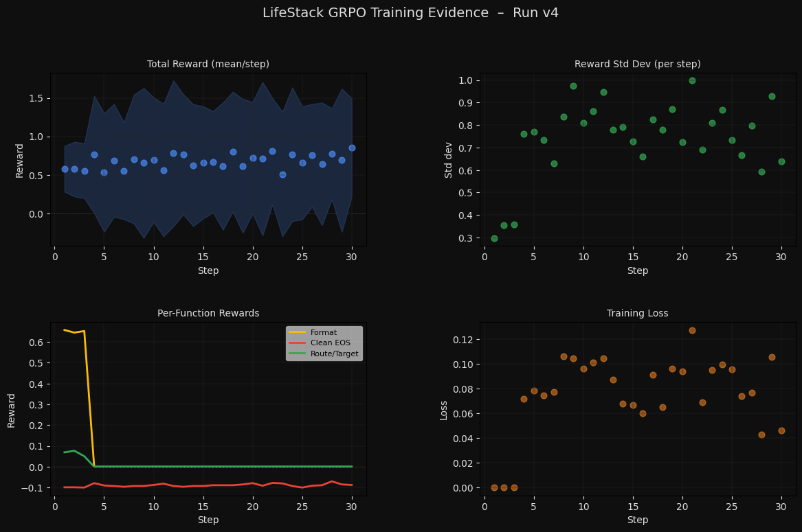
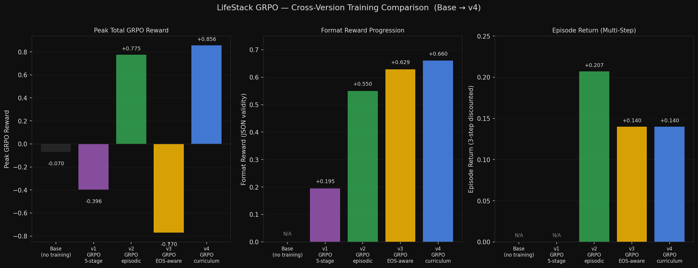

[](https://huggingface.co/spaces/jdsb06/meta-r2)
[](https://huggingface.co/jdsb06/lifestack-grpo)
[](https://huggingface.co/jdsb06/lifestack-grpo-v2)
[](https://huggingface.co/jdsb06/lifestack-grpo-v3)
[](https://huggingface.co/jdsb06/lifestack-grpo-v4)
[](https://github.com/meta-pytorch/OpenEnv)

---

## Quick Links for Judges

| What | Link |
|------|------|
| 🚀 **Live Demo (HF Space)** | https://huggingface.co/spaces/jdsb06/meta-r2 |
| 📝 **Mini-Blog / Model Card** | https://huggingface.co/jdsb06/lifestack-grpo-v4 |
| 🎓 **Re-runnable Colab Training Notebook** | [Colab_GRPO_Training.ipynb](https://colab.research.google.com/drive/184NGSW_BkLQAmOGgDlgEqrArJqBHr-B9?usp=sharing) |
| 📊 **Training Evidence (plots)** | [plots/](plots/) — reward curve, loss curve, components, summary |
| 🏋️ **v4 Training Log (raw)** | [train_run_v4.log on HF](https://huggingface.co/jdsb06/lifestack-grpo-v4/blob/main/train_run_v4.log) |
| 🏋️ **v1 Training Log (raw)** | [train_run_v1.log](train_run_v1.log) |
| 🤖 **All models** | [v1](https://huggingface.co/jdsb06/lifestack-grpo) · [v2](https://huggingface.co/jdsb06/lifestack-grpo-v2) · [v3](https://huggingface.co/jdsb06/lifestack-grpo-v3) · [v4](https://huggingface.co/jdsb06/lifestack-grpo-v4) |
| 🌐 **GitHub Source** | https://github.com/oki-dokii/Meta-R2 |

---

It's Friday 6PM. Your flight got cancelled. Your card got declined trying to rebook. Slack notification: your boss moved Monday's deadline to Sunday. You have $200 in cash, five hours of usable energy, and four people expecting you in different places. You ask an AI for help. It books the flight — but the only affordable option has a 12-hour layover. It drafts a message to your boss — but the tone triggers a "clarification" meeting that eats more time. Every solution applied in isolation opens a new wound somewhere else.

LifeStack is built around exactly this problem. It is a multi-domain life-management reinforcement learning environment on OpenEnv 0.2.3, modelling a human life as a system of 23 interdependent metrics across 6 life domains, where every action cascades through a 32-edge directed dependency graph with consequences you often cannot predict. We trained `Qwen2.5-1.5B-Instruct` on this environment using GRPO (Group Relative Policy Optimization) — a 5-stage single-step curriculum followed by episodic multi-step fine-tuning — producing a model that allocates time, money, and energy across competing life priorities without collapsing any domain below crisis threshold.

---

## What Judges Can Explore in the Live Demo

The [live HF Space](https://huggingface.co/spaces/jdsb06/meta-r2) runs **v4** on a T4 GPU. Six interactive tabs:

| Tab | What it demonstrates |
|-----|---------------------|
| **Personality Lab** | Pick a Big Five (OCEAN) profile — high conscientiousness + high neuroticism responds differently to the same crisis than low agreeableness + high extraversion. The model adapts its action strategy to personality. |
| **What-If Lab** | For any crisis, v4 proposes an action then generates 3 counterfactual alternatives (`rest`, `negotiate`, `delegate`). All from the trained model — no Groq fallback. Demonstrates policy diversity. |
| **Untrained vs GRPO-Trained** | Side-by-side: vanilla Groq 70B vs the v4 GRPO adapter on the same prompt. The trained model picks more targeted, resource-aware actions. |
| **Model Evolution (v1→v4)** | All 4 model versions loaded simultaneously on the same scenario. Policy shift is visible across training iterations — v2 starts delegating where v1 rests; v4 reasons about resource constraints that v1 ignores. |
| **Longitudinal Memory** | ChromaDB retrieves past successful trajectories for the same personality type. After enough interactions, the agent references its own history: *"Last time you cancelled plans without warning, it took 4 days to recover."* |
| **Live Simulation** | Real-time cascade animation across the 40-edge dependency graph, with the agent proposing interventions at each step. |

---

## How it works

The RL loop is concrete and sequential:

1. `reset()` picks a life conflict scenario — a `Task` object containing a `visible_world`, `hidden_state`, `event_schedule`, `viable_routes`, and `milestones`. The `LifeMetrics` state (23 values across 6 domains) is seeded via `DependencyGraph.cascade()` on the task's initial disruption.
2. The agent receives a `LifeStackObservation` — flattened 23-metric values, remaining budget (`time_hours`, `money_dollars`, `energy_units`), current step count, visible world state, active milestones, and fired event IDs.
3. The agent submits a `LifeStackAction` — structured JSON with `action_type`, `target_domain`, `metric_changes`, `resource_cost`, and `reasoning`. Ten valid action types exist: `negotiate`, `communicate`, `delegate`, `spend`, `reschedule`, `rest`, `deprioritize`, `execute`, `prepare`, `self_care`.
4. `WorldEngine` injects any scheduled or probabilistic `ExoEvent` objects for this step, mutating world state and potentially closing routes the agent was planning to use.
5. The `DependencyGraph` propagates metric changes through 32 directed edges with a 0.6 dampening factor per hop — touching `career.workload` automatically reduces `time.free_hours_per_week` and raises `mental_wellbeing.stress_level`, which then degrades `physical_health.sleep_quality`, and so on.
6. `LifeStackVerifier` checks success conditions, failure conditions, and newly unlocked milestones. Ten reward functions score the step.
7. `env.rollout(n_steps=7, gamma=0.9)` runs seven null actions from the post-step state, computing the discounted long-horizon consequence signal without mutating the environment.
8. The episode ends when `step_count >= task.horizon`, any metric drops to `<= 10`, explicit failure conditions trigger, or all viable routes are exhausted.

---

## The core mental model

### Visible state (LifeStackObservation)

The agent sees `metrics` (all 23 flattened values), `resources` (time/money/energy remaining), `step` count, `metadata.world_state` (partial view of `mutable_world` plus any keys the agent has explicitly `inspect`ed), `metadata.goal`, `metadata.active_route`, `metadata.milestones`, and `metadata.events`.

### Hidden consequences

The agent cannot directly observe: cascade effects downstream from its action (`DependencyGraph` propagates silently), future `ExoEvent` triggers (some are probabilistic with `step=-1`), `hidden_state` fields (revealed only by an `inspect` action), and long-horizon stress accumulation that makes later steps harder.

### The 6 life domains and 23 metrics

These are the exact `LifeMetrics` fields in `core/life_state.py`. The 8 task domains add `transport_crisis` and `code_merge_crisis` as scenario types but they do not have their own metric subfields — they affect the same 23 values.

| Domain | Metrics | Notes |
|--------|---------|-------|
| `career` | `satisfaction`, `workload`, `stability`, `growth_trajectory` | `workload` is inverted (higher = worse) |
| `finances` | `liquidity`, `debt_pressure`, `monthly_runway`, `long_term_health` | `debt_pressure` is inverted |
| `relationships` | `romantic`, `family`, `social`, `professional_network` | All positive-direction |
| `physical_health` | `energy`, `fitness`, `sleep_quality`, `nutrition` | All positive-direction |
| `mental_wellbeing` | `stress_level`, `clarity`, `motivation`, `emotional_stability` | `stress_level` is inverted |
| `time` | `free_hours_per_week`, `commute_burden`, `admin_overhead` | `commute_burden` and `admin_overhead` are inverted |

All metrics are clamped to `[0, 100]`. Cascade propagation has a floor of `10.0` for downstream nodes (`is_cascade=True`). Any metric reaching `<= 10` terminates the episode as a failure.

---

## Main building blocks

**`core/lifestack_env.py`** — `LifeStackEnv` is the central class. It inherits from OpenEnv's `Environment` base (with a multi-level import shim that falls back gracefully if `openenv-core` is absent, controlled by the `USING_MODERN_API` flag). `reset()` initializes a `LifeStackState` — which holds the current `LifeMetrics`, `ResourceBudget`, inspected keys, consecutive wait count, rollback flag, and task state — then constructs a `WorldEngine` for the task. `step()` handles rollback, inspect, wait, route execution, resource deduction, metric updates with cascade, task progression checks, and reward computation. `rollout()` snapshots `_internal_state`, runs `n_steps` null rest actions, accumulates discounted rewards, then restores the snapshot — no side effects. `PartialObsFilter` controls what the agent sees: `visible_world` plus any keys the agent has previously `inspect`ed (hidden-state reveals are tagged `{"source": "inspect"}`).

**`core/reward.py`** — Contains `compute_reward()` (the base step reward: 4 components with weights 0.50/0.25/0.15/0.10) and `compute_task_reward()` (the task-aware orchestrator: 6 components with weights 0.35/0.25/0.15/0.10/0.05 + penalties). Four standalone scoring functions are also here: `reward_format_compliance()`, `reward_plausibility_check()`, `reward_timeout_check()`, and `reward_reasoning_coherence()`. These are called both from within the environment and directly as GRPO reward functions in `scripts/train_trl.py`.

**`core/life_state.py`** — Defines `LifeMetrics` (6 domain dataclasses, 23 total fields), `ResourceBudget` (with `deduct()` that refuses overdrafts), and `DependencyGraph` (32 directed weighted edges with 0.6 dampening per hop). The cascade algorithm uses a BFS queue with a `per_step_cascade_cap=3` to prevent runaway propagation from a single large action.

**`core/cascade_utils.py`** — `animate_cascade()` replays the same `DependencyGraph` propagation frame-by-frame (primary → first-order → second-order) and returns a list of snapshots. The Flask demo's vis-network cascade visualization is driven by this function.

**`core/verifier.py`** — `LifeStackVerifier` is a stateless utility class with three methods: `check_success()` (evaluates task success conditions against world/hidden state), `check_failure()` (evaluates failure conditions plus metric-death check at `<= 10`), and `check_new_milestones()` (scans task milestones for newly satisfied conditions). `get_route_status()` counts reachable routes given the current closed-route set and precondition state.

**`core/task.py`** — Defines the `Task` dataclass (with `domain`, `goal`, `constraints`, `hidden_state`, `mutable_world`, `visible_world`, `success_conditions`, `failure_conditions`, `event_schedule`, `viable_routes`, `milestones`, `horizon`, `difficulty`). Two concrete task factories: `FlightCrisisTask()` (horizon=30, two competing routes, two timed ExoEvents) and `CodeMergeCrisisTask()` (horizon=10, two competing routes). `TaskGenerator` holds both and calls `get_random_task()`. The richer `TaskGenerator` in `agent/conflict_generator.py` covers all 8 task domains with template-based generation.

**`agent/agent.py`** — `LifeStackAgent` handles prompt construction, model inference, and action parsing. On initialization it starts a background thread to load the GRPO adapter from `DEFAULT_HF_MODEL_REPO = "jdsb06/lifestack-grpo-v4"` (via `PeftConfig` + `PeftModel`). If the local model fails, it falls back to Groq API (`llama-3.3-70b-versatile`). `build_prompt()` injects memory context from `LifeStackMemory.build_few_shot_prompt()` when available. The in-memory `self.memory` list stores per-episode decision history for context.

**`agent/memory.py`** — `LifeStackMemory` wraps three ChromaDB collections: `decisions`, `trajectories`, and `feedback`. It uses `SentenceTransformer('all-MiniLM-L6-v2')` for embeddings, falling back to a hash-based 384-dim vector when the model is unavailable. `retrieve_similar()` queries the `decisions` collection by embedding the conflict title plus the three most-stressed metric values, then filters results to reward ≥ 0.05. `build_few_shot_prompt()` formats retrieved memories as a few-shot context block injected into the agent's prompt. On first init, if the collection is empty, it auto-hydrates from `data/preseeded_memory*.json`.

**`scripts/train_trl.py`** — The main GRPO training script. `train_curriculum()` runs 5 stages of single-step training using plain `GRPOTrainer` (stage 1 uses 3 reward functions for JSON warm-up, stages 2-5 use 10). `train_episodic_curriculum()` runs 2+ stages of multi-step trajectory training using `LifeStackGRPOTrainer` — a subclass that overrides `_prepare_inputs()` to zero-out `completion_mask` tokens after the first complete JSON object. Both support `--resume` via `curriculum_state.json`. The `load_model()` function tries Unsloth's 4-bit path first, then falls back to plain HF+PEFT (`Qwen/Qwen2.5-1.5B-Instruct` in bf16 on A100+, fp16 otherwise).

---

## Reward design

### Per-step reward (base step, no task)

`compute_reward()` computes four components and combines them:

```
base_reward = (0.50 × outcome_score) +
              (0.25 × cascade_containment_score) +
              (0.15 × resource_efficiency_score) +
              (0.10 × relationship_preservation_score)
```

Then applies penalties before clamping to `[-1.0, 1.0]`.

### Per-step reward (task-aware)

`compute_task_reward()` replaces the base formula with a task-oriented weighting:

```
base_reward = (0.35 × milestone_score) +
              (0.25 × completion_score) +
              (0.15 × outcome_score_local) +
              (0.10 × replan_score) +
              (0.10 × efficiency_score) +
              (0.05 × preservation_score)
```

### The 10 GRPO reward functions (stages 2–5 of single-step curriculum)

| Function | What it measures | Range |
|----------|-----------------|-------|
| `reward_format_fn` | Valid JSON, all 5 required keys, valid `action_type` and `target_domain` | `[-1.0, +1.0]` |
| `reward_clean_eos_fn` | Model stops within 8 chars of closing JSON brace | `[-0.10, +0.20]` |
| `reward_route_target_fn` | `target_domain` matches a listed route ID with `action_type="execute"` | `[0.0, +0.30]` |
| `reward_plausibility_fn` | Ratio of `total_metric_delta / normalized_cost`; penalizes free lunch | `[-0.30, 0.0]` |
| `reward_task_success_fn` | Task completion score from full environment simulation | `[0.0, +1.0]` |
| `reward_milestone_fn` | Milestone achievement score (partial credit per milestone hit) | `[0.0, +1.0]` |
| `reward_replan_fn` | Ability to hit milestones *after* an ExoEvent fires | `[0.0, +0.5]` |
| `reward_reasoning_fn` | Reasoning length + logical-connector check + action-keyword alignment | `[-0.30, +0.30]` |
| `reward_human_feedback_fn` | ChromaDB similarity to past episodes with stored human outcome feedback | `[0.0, +1.0]` |
| `reward_longterm_fn` | 7-day γ=0.9 discounted rollout from current post-action state | `[-1.0, +1.0]` |

Stage 1 (JSON warm-up) uses only `reward_format_fn`, `reward_clean_eos_fn`, `reward_route_target_fn` with weights `[1.0, 1.5, 1.0]`.

Episodic training (v4) uses `reward_episode_format_fn`, `reward_clean_eos_fn`, `reward_episode_plausibility_fn`, `reward_episode_return_fn` with weights `[1.0, 0.5, 0.5, 2.0]`.

### Anti-hacking specifics

The `reward_plausibility_check()` gate fires for any non-trivial metric claim (`total_delta > 3.0`) with zero resource cost, returning `-0.30`. For non-zero cost, the claim-to-cost ratio threshold is 150 (severe: `-0.30`) and 80 (suspicious: `-0.10`). `reward_reasoning_coherence()` requires both structural logic connectors ("because", "therefore", etc.) AND semantic alignment between reasoning text and `action_type` — misaligned reasoning gets `-0.20`.

---

## Training stack

The base model is `Qwen/Qwen2.5-1.5B-Instruct` (1.5B parameters). `load_model()` in `scripts/train_trl.py` first tries the Unsloth path (`unsloth/Qwen2.5-1.5B-Instruct` in 4-bit), then falls back to plain HF+PEFT with `LoraConfig(r=16, lora_alpha=16)` targeting all 7 projection layers. On A100 80GB the HF+PEFT path is recommended — set `LIFESTACK_NO_UNSLOTH=1` to skip Unsloth and avoid dtype collisions with the 4-bit kernel.

`LifeStackGRPOTrainer` (used in episodic training) overrides `_prepare_inputs()` to locate the JSON-object boundary in each completion and zero out `completion_mask` tokens beyond it. The token IDs stay intact — no distribution shift — but the KL and advantage terms see only the ~100 JSON tokens instead of 480 trailing explanation tokens. This gives roughly 3–5× sharper gradient signal per step.

### 5-stage single-step curriculum (`train_curriculum`)

| Stage | LR | Reward functions | Dataset |
|-------|----|-----------------|---------|
| 1 | 8e-6 | `format`, `clean_eos`, `route_target` | 100 prompts, difficulty 1 |
| 2 | 5e-6 | All 10 | 100 prompts, difficulty ≥ 1 |
| 3 | 3e-6 | All 10 | 100 prompts, difficulty ≥ 2 |
| 4 | 2e-6 | All 10 | 100 prompts, difficulty ≥ 3 |
| 5 | 1e-6 | All 10 | 100 prompts, difficulty ≥ 4 |

Difficulty advances when stage-end reward ≥ 0.0. Curriculum state is persisted to `curriculum_state.json` — resume with `--resume`.

### Episodic curriculum (`train_episodic_curriculum`, v3/v4)

Uses `LifeStackGRPOTrainer` + 4 episodic reward functions. Each prompt asks the model to return an `{"actions": [...]}` sequence executed by the real environment for 3 steps (default `episode_horizon=3`). `reward_episode_return_fn` is the dominant signal (weight 2.0) — it computes the discounted trajectory reward plus a `+0.25` terminal bonus on success.

### Key environment variables

| Variable | Default | Purpose |
|----------|---------|---------|
| `OPENENV_HOST` | `0.0.0.0` | OpenEnv server bind address |
| `OPENENV_PORT` | `8000` | OpenEnv server port |
| `OPENENV_MAX_SESSIONS` | `4` | Max concurrent environment instances |
| `PORT` | `7860` | Flask UI port (set by HF Spaces) |
| `LIFESTACK_NO_UNSLOTH` | unset | Set to `1` to skip Unsloth and use HF+PEFT |
| `GROQ_API_KEY` | unset | Enables Groq API fallback in the agent |
| `HF_TOKEN` | unset | Required for loading private model checkpoints |

### A note on training environment

We ran into consistent import and binary wheel issues on both Kaggle and Colab while iterating on the same dependency stack. The training that produced the v4 logs and plots was done on HuggingFace (Jupyter + terminal on the Space), which stayed stable. The Colab notebook in this repo is for anyone who wants to re-run the same CLI elsewhere — expect hosted runtimes to be hit-or-miss with this stack.

---

## Anti-reward-hacking

Every mechanism described here exists in the actual code:

`reward_plausibility_check()` in `core/reward.py` fires a `-0.30` penalty whenever an action claims non-trivial metric improvements (`total_delta > 3.0`) with zero resource cost. This closes the "free metrics" exploit where the model would request large improvements and specify `resource_cost: {}`.

`REST_NOT_JUSTIFIED` fires in `compute_reward()` with `-0.25` whenever `action_type == "rest"` and the average energy metric is above 30. Without this, the model learned that rest has near-zero cost and positive energy recovery, making it the optimal action regardless of context.

`WAIT_CAP_EXCEEDED` in `step()` applies `+15.0` to `mental_wellbeing.stress_level` after 4 consecutive `wait` actions. Without this cap the model could stall indefinitely.

`CASCADE_SPREAD_WIDER` in `compute_reward()` fires with `-0.30` when the number of metrics that worsened after the step exceeds the number of metrics the agent directly changed. This penalizes actions that cause broader damage than their stated scope.

`ROLLBACK_USED` fires with `-0.1` penalty in `compute_task_reward()` — once per episode. Rollback is available as a recovery mechanism but costs. The `used_rollback` flag on `LifeStackState` prevents using it twice.

`action_type` is validated against `VALID_ACTION_TYPES` (a `frozenset` in `core/reward.py`). `metric_changes` in `step()` are filtered through `allowed_keys = set(self._internal_state.current_metrics.flatten().keys())` — the model cannot invent new metric paths.

---

## Deployment

LifeStack runs as two services inside a single Docker container. `start.sh` (the Docker `CMD`) starts `server.py` in the background on port 8000, waits 3 seconds for it to bind, then runs `app_flask.py` in the foreground on port 7860.

HuggingFace health-checks port 7860, so the Flask process must stay alive. `server.py` is written to return silently on any failure (missing `openenv-core`, `create_app` crash, etc.) rather than calling `raise SystemExit` — if the OpenEnv server crashes, the Flask UI keeps the Space alive and the demo remains functional. All `server.py` error paths use `print()` + `return`.

```bash
# Docker
docker build -t lifestack .
docker run -p 7860:7860 -p 8000:8000 lifestack

# Local dev — run services separately
python server.py                  # OpenEnv on :8000
python app_flask.py               # Flask UI on :7860

# Connect via OpenEnv client
from openenv import EnvClient
client = EnvClient("http://localhost:8000")
obs = client.reset()
```

---

## Project map

```
Meta-r2/
├── core/
│   ├── lifestack_env.py      # LifeStackEnv, WorldEngine, PartialObsFilter
│   ├── life_state.py         # LifeMetrics (23 values), DependencyGraph (32 edges)
│   ├── reward.py             # compute_reward, compute_task_reward, 4 scoring fns
│   ├── cascade_utils.py      # animate_cascade() — frame-by-frame cascade replay
│   ├── action_space.py       # AgentAction, PrimaryAction, apply_action
│   ├── task.py               # Task, ExoEvent, Route, Milestone, FlightCrisisTask
│   ├── verifier.py           # LifeStackVerifier (success/failure/milestone checks)
│   ├── feedback.py           # OutcomeFeedback, compute_human_feedback_reward
│   └── metric_schema.py      # VALID_METRIC_PATHS, normalize_metric_path
├── agent/
│   ├── agent.py              # LifeStackAgent (GRPO model + Groq fallback)
│   ├── memory.py             # LifeStackMemory (ChromaDB, 3 collections)
│   ├── conflict_generator.py # TaskGenerator (8 domains), TEMPLATES, ExoEvent injection
│   ├── conflict_predictor.py # ConflictPredictor (pattern matching on episode history)
│   └── counterfactuals.py    # What-if reasoning over metric snapshots
├── intake/
│   ├── simperson.py          # SimPerson (Big Five personality → action uptake scaling)
│   ├── intake.py             # Data ingestion pipeline
│   ├── gmail_intake.py       # Gmail OAuth source
│   └── calendar_intake.py    # Google Calendar OAuth source
├── server/
│   └── app.py                # OpenEnv FastAPI server (create_app wrapper)
├── scripts/
│   ├── train_trl.py          # Full GRPO training — single-step + episodic curriculum
│   ├── eval.py               # Evaluation script, random baseline
│   ├── plot_training.py      # Parse training logs → reward/loss/component plots
│   └── smoke_test.py         # Fast pipeline check (no GPU needed)
├── notebooks/
│   ├── Colab_GRPO_Training.ipynb   # Re-runnable training notebook
│   └── Training_Evidence.ipynb     # Plot generation from logs
├── data/
│   ├── conflicts.json              # 20+ named conflict scenarios
│   ├── training_log.json           # Episode reward history
│   └── before_after_comparison.json # Memory ablation results
├── plots/                          # Training evidence plots (v4 real run)
├── docs/                           # All project documentation
├── app_flask.py                    # Flask UI — port 7860, 10 tabs, Chart.js
├── server.py                       # Crash-safe OpenEnv server entry point
├── start.sh                        # Docker CMD — dual service startup
├── Dockerfile                      # python:3.11-slim, exposes 7860 + 8000
└── openenv.yaml                    # OpenEnv manifest
```

---

## Training evidence





---

## Quick start

```bash
# Clone and install
git clone https://github.com/oki-dokii/Meta-R2.git
cd Meta-R2
bash setup.sh        # creates .venv, installs requirements.txt, runs smoke test

# Activate and run
source .venv/bin/activate
python app_flask.py  # Flask UI → http://localhost:7860
python server.py     # OpenEnv server → http://localhost:8000

# Smoke test (no GPU, no downloads)
python scripts/smoke_test.py

# Full training (requires GPU, ~2h on A100 80GB)
LIFESTACK_NO_UNSLOTH=1 python scripts/train_trl.py

# Dry run (CPU, validates pipeline end-to-end in ~60s)
python scripts/train_trl.py --dry-run
```

The trained checkpoints for v1, v2, v3, and v4 are on HuggingFace Hub at `jdsb06/lifestack-grpo`, `jdsb06/lifestack-grpo-v2`, `jdsb06/lifestack-grpo-v3`, and `jdsb06/lifestack-grpo-v4`. Load them with standard `PeftModel.from_pretrained()` against `Qwen/Qwen2.5-1.5B-Instruct` as the base.
