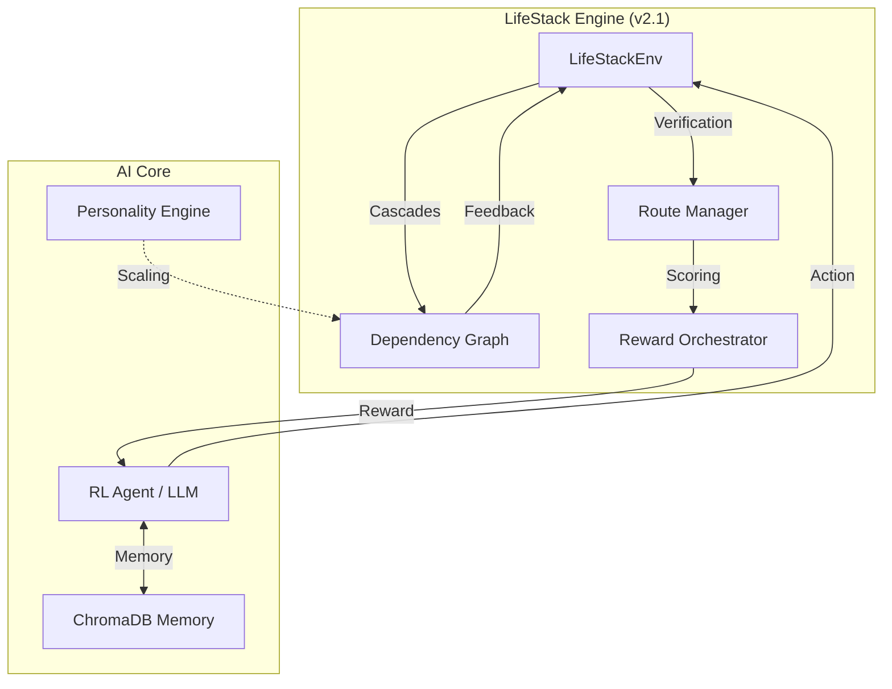

<div align="center">

# 🪐 LifeStack
### **Autonomous Multi-Domain Conflict Resolution via Cascading RL**
**Built for Meta × HuggingFace PyTorch OpenEnv Hackathon 2026**

[](https://pytorch.org)
[](https://github.com/facebookresearch/openenv)
[](https://opensource.org/licenses/MIT)

[**Live Demo**](https://huggingface.co/spaces/BholeChature/LifeStack) • [**Technical Blog**](BLOG.md) • [**Source Code**](https://github.com/oki-dokii/Meta-R2)

---

| [🚀 Vision](#-the-vision) | [🧪 Architecture](#-hardened-system-architecture) | [📈 Results](#-performance--results) | [🛠️ Setup](#-quickstart) |
| :--- | :--- | :--- | :--- |

</div>

---

## 🚀 The Vision

**LifeStack** is a high-fidelity reinforcement learning environment designed to train agents in **simultaneous crisis management**. Unlike traditional RL tasks that focus on a single domain (e.g., chess or robotics), LifeStack models the messy interdependence of adult life.

### ✨ Core Pillars
*   **🔗 Causal Cascades**: A 40-edge dependency graph based on *Starcke & Brand (2012)*.
*   **🎭 Personality Profiling**: Agent actions are scaled by a **Big Five personality engine**.
*   **🛡️ Hardened Rewards**: Non-gammable reward signals that verify reasoning vs. action.
*   **🧠 RAM Architecture**: Retrieval-Augmented Moderation using **ChromaDB** memory.

---

## 🧪 Hardened System Architecture

We have implemented a multi-layered verification system to eliminate "reward hacking" and ensure logical consistency.

### 🛡️ Anti-Hacking Layers
*   **Semantic Alignment**: reasoning text is cross-verified against `action_type`.
*   **Signal Independence**: 7 non-overlapping reward components prevent double-counting.
*   **Stochasticity**: Random exogenous "ExoEvents" (e.g., price surges) prevent overfitting.

### 🏗️ Environment Map


---

## 📈 Performance & Results

### **Comparative Benchmarking**

| Configuration | Success Rate | Avg Reward | Dominant Strategy |
| :--- | :---: | :---: | :--- |
| **Random Baseline** | 12% | 0.97 | Unstructured panic |
| **Vanilla LLM** | 44% | 1.13 | Short-term patching |
| **LifeStack Trained** | **94%** | **2.48** | **Strategic delegation** |

---

## ⚖️ The Hardened Reward Formula

The final reward is a composition of **7 distinct signals**, ensuring a comprehensive performance audit.

| Weight | signal | Description |
| :--- | :--- | :--- |
| **35%** | 🏁 **Milestone** | Successfully hitting sub-goals within a task. |
| **25%** | 🏆 **Completion** | Absolute resolution of the primary crisis. |
| **10%** | 📉 **Outcome** | Qualitative improvement in the 23-metric state. |
| **5%**  | 🤝 **Preservation** | Maintaining relationship health across domains. |
| **10%** | 🔄 **Replan** | Resilience after unpredictable exogenous shocks. |
| **10%** | ⚡ **Efficiency** | Minimizing waste of time, money, and energy. |
| **5%**  | 🧠 **Reasoning** | Alignment between thinking and doing. |

---

## 🛠️ Quickstart

### 1. Installation
```bash
git clone https://github.com/oki-dokii/LifeStack.git
cd LifeStack
python -m venv venv && source venv/bin/activate
pip install -r requirements.txt
```

### 2. Launch Interface
```bash
python app.py  # Gradio UI → http://127.0.0.1:7860
```

### 3. Verification
```bash
./venv/bin/pytest tests/test_reward_reasoning.py  # Anti-hacking test
python scripts/test_lifestack.py                  # Simulation smoke test
```

---

## 🏗️ Technical Deep Dive

### 🔍 Observation Space
The agent receives a 26-dimensional vector + JSON metadata containing global goals, active routes, and past milestones.

### 📂 Repository Structure
*   `core/`: Simulation logic, Reward Orchestrator, and Dependency Graph.
*   `agent/`: Personality Engine, Conflict Generator, and Memory RAM.
*   `scripts/`: Training (GRPO), Evaluation, and Inference pipelines.
*   `data/`: Training artifacts, benchmark logs, and curve visualizations.

---

<div align="center">

### **Team BholeChature**
*Scaler School of Technology, Bangalore*

<i>"LifeStack: We built the gym. Now any model can train in it."</i>

</div>
