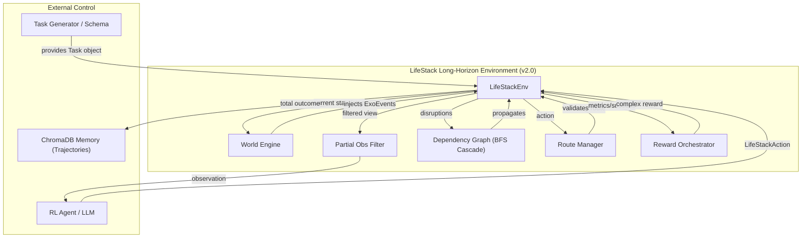

# LifeStack
### An RL Environment for Multi-Domain Life Conflict Resolution
**Built for Meta × HuggingFace PyTorch OpenEnv Hackathon — Grand Finale 2026**

---

LifeStack is the first OpenEnv-compatible environment that trains agents to resolve cascading real-life conflicts across 6 interconnected domains simultaneously, under finite resource constraints, with Pareto-optimal reward shaping. 

**v2.0 Update: Long-Horizon Challenge**
LifeStack now supports complex, branching 20–50 step episodes with dynamic world events, hidden state variables, and partial observability — moving beyond simple linear conflict resolution to true strategic life planning.

---

## Architecture



---

## Quick Start

```bash
git clone https://github.com/oki-dokii/Meta-R2
cd Meta-R2
bash setup.sh
source .venv/bin/activate
python app.py          # Launch Gradio demo  →  http://127.0.0.1:7860
python scripts/train_trl.py   # Run long-horizon GRPO training
```

> **Verify openenv installed:** `pip3 show openenv-core` — should show `Version: 0.2.3`  
> **Note:** LifeStack is built on the `Task` schema — define a crisis, routes, and milestones inside `core/task.py`.

---

## Environment v2.0 Overview

The environment has transitioned from short, linear conflicts to a **Long-Horizon Strategy Engine**:

1.  **Task System**: Episodes are driven by a serialized `Task` object. Each task defines a goal, a horizon (20–50 steps), a budget, and a branching set of **Routes**.
2.  **World Engine & Exogenous Events**: The environment is no longer static. Random or deterministic `ExoEvents` (e.g., a ticket price surge or a sudden illness) can mutate the world state and close off specific routes mid-episode.
3.  **Partial Observability**: The agent no longer sees the full internal state. It must use `inspect` actions to reveal `HiddenStateField` values, balancing the cost of information gathering against the clock.
4.  **Route Branching**: Instead of just adjusting metrics, agents select and execute `Routes`. Each route has `preconditions` (checks against world/hidden state) and `consequences` (mutations on success).
5.  **Trajectory Memory**: ChromaDB now stores full **episodic trajectories**, allowing agents to retrieve entire successful strategies (chain of thoughts + route paths) based on domain similarity.

---

## Advanced Reward System (Orchestrator)

The reward function now incentivizes long-term success over immediate metric gains:

```
reward = (0.10 × metric_delta)       # Local step improvement
       + (0.40 × milestone_reward)   # Reaching key progress markers
       + (0.30 × completion_reward)  # Final goal achievement
       + (0.10 × replan_bonus)       # Ability to recover from ExoEvents
       + (0.10 × efficiency)         # Resource preservation
       + penalties
```

| New Penalties | Description |
|---|---|
| `-0.50` Dead End | Applied if all viable routes are closed (failure to plan) |
| `-0.10` Rollback | Small cost for undoing an action (discourages brute force) |
| `-0.30` Cascade Collapse | Applied if any metric drops from a safe zone (>20) to critical (<10) |
| `-0.50` Wait Cap | Triggered if agent waits 4 times consecutively without acting |

---

## Deployment (OpenEnv Native)

LifeStack is a fully qualified OpenEnv project. Use the environment service to interact with agents via MCP or REST.

**Launch Environment Service:**
```bash
python3 server.py      # Starts the environment server on port 8000
```
- **Web Interface:** `http://localhost:8000/web`
- **MCP Tool List:** `http://localhost:8000/mcp`
- **CLI Manifest:** See `openenv.yaml` for integration details.

---

## File Structure

| File | Description |
|---|---|
| `core/task.py` | **NEW:** Dataclass schema for Tasks, ExoEvents, Routes, and Milestones |
| `core/lifestack_env.py` | **UPDATED:** Logic for WorldEngine, PartialObsFilter, and Long-Horizon Step processing |
| `core/reward.py` | **UPDATED:** Task-aware reward orchestrator with completion bonuses |
| `agent/conflict_generator.py` | **NEW:** `TaskGenerator` class for automated crisis scenario building |
| `agent/memory.py` | **UPDATED:** Trajectory storage and retrieval for episode-level learning |
| `core/life_state.py` | Dependency graph with `METRIC_FLOOR` and BFS cascade bounding |
| `app.py` | Gradio interface including the **Task Explorer** tab for real-time visualization |

---

## Team

**Team of 3 — Scaler School of Technology, Bangalore**

---

*LifeStack: We built the gym. Now any model can train in it.*
