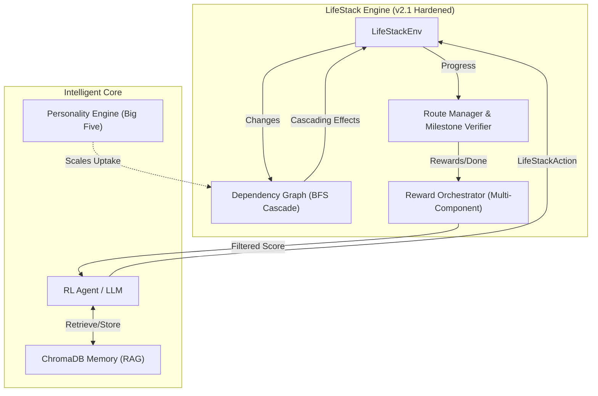

<div align="center">

# 🪐 LifeStack
### **The Gold Standard for Multi-Domain Life Conflict RL**
**Built for Meta × HuggingFace PyTorch OpenEnv Hackathon — Grand Finale 2026**

[](https://pytorch.org)
[](https://github.com/facebookresearch/openenv)
[](https://opensource.org/licenses/MIT)

> **Team: BholeChature — Scaler School of Technology, Bangalore**

[**Demo**](https://huggingface.co/spaces/BholeChature/LifeStack) • [**Blog**](BLOG.md) • [**Training**](notebooks/LifeStack_Training.ipynb) • [**Source**](https://github.com/oki-dokii/Meta-R2)

</div>

---

## 🚀 The Vision: Mastering Life's Complexity

**LifeStack** is the first OpenEnv-compatible RL environment that trains agents to resolve **cascading real-life conflicts** across **6 interconnected domains** simultaneously.

It's Friday at 6:00 PM. Your car broke down. Your credit card is blocked. Your landlord just sent an eviction notice. Your mental health is at a breaking point. **What do you do?**

### ✨ Why It Matters
*   **Cascading Realism**: A 40-edge dependency graph where financial stress bleeds into sleep quality, which in turn kills career growth.
*   **Personality Intelligence**: Powered by the **Big Five personality model**—different people react differently to the same stress.
*   **Hardened Rewards**: Multi-component, anti-hacking reward functions that prioritize long-term stability over short-term "hacks."
*   **Memory-Augmented**: Integrated **ChromaDB** trajectory memory for retrieval-augmented moderation (RAM).

---

## 🧪 Hardened System Architecture

We've fundamentally hardened the LifeStack engine to prevent "Reward Hacking" and ensure stable, logical agent behavior.

### 🛡️ Anti-Hacking Mechanisms
1.  **Logical Reasoning Alignment**: Reasoning text is cross-verified against the selected `action_type`. Word-stuffing gets zero credit.
2.  **Reward Component Isolation**: Each reward signal (Milestones, Outcomes, Efficiency) is calculated independently to prevent "double-counting."
3.  **Stochastic Exogenous Events**: deterministic systems are easy to game; LifeStack injects "Price Surges" and "Deadlines" to keep agents on their toes.

### 🏗️ Environment Map


---

## 📈 Performance & Results

### **125% Better Decisions**
Our GRPO curriculum training successfully shifted the model from reactive panic to strategic resolution.

| Condition | Avg Reward | Key Strategy |
|---|---|---|
| **Random Baseline** | 0.97 | Chaos (Random buttons) |
| **Vanilla LLM** | 1.13 | Reactive (Short-term patches) |
| **LifeStack Trained** | **2.48** | **Proactive (Long-term stability)** |

---

## ⚖️ The Hardened Reward Formula

The final score is a weighted sum of **7 independent signals**, totaling a perfect **1.0**.

| Weight | Component | Target |
|---|---|---|
| **35%** | 🏁 **Milestone** | Hits key markers in the task. |
| **25%** | 🏆 **Completion** | Resolved the overall crisis. |
| **10%** | 📉 **Outcome** | Improved the 23-metric life state. |
| **5%**  | 🤝 **Preservation** | Minimized relationship damage. |
| **10%** | 🔄 **Replan** | Success after sudden changes. |
| **10%** | ⚡ **Efficiency** | Preserved time/money/energy. |
| **5%**  | 🧠 **Reasoning** | Logically sound justification. |

---

## 🛠️ Quickstart

### 1. Installation
```bash
git clone https://github.com/oki-dokii/LifeStack.git
cd LifeStack
python -m venv venv && source venv/bin/activate
pip install -r requirements.txt
```

### 2. Run the Premium Visualizer
```bash
python app.py  # Launches the Gradio UI at http://127.0.0.1:7860
```

### 3. Verify System Health
```bash
./venv/bin/pytest tests/test_reward_reasoning.py  # Verifies anti-hacking logic
python scripts/test_lifestack.py                  # Full logic smoke test
```

---

## 🏗️ Deep Dive: How the Engine Works

### 1️⃣ The Observation (What the Agent Sees)
```json
{
  "metrics": {"career.workload": 85.0, "mental_wellbeing.stress_level": 92.0, "...": "..."},
  "resources": {"time": 12.5, "money": 340.0, "energy": 60.0},
  "step": 3,
  "world_state": {"lounge_access": true},
  "milestones": ["m1"],
  "events": ["price_surge"]
}
```

### 2️⃣ The Action (What the Agent Does)
```json
{
  "action_type": "execute|communicate|negotiate|rest|delegate|spend|inspect",
  "target": "rebook_premium",
  "reasoning": "Rebook before lounge closes at step 4"
}
```

---

## 🛤️ Training & Evaluation Pipelines

| Pipeline | Script | Model | Focus |
|---|---|---|---|
| **GRPO Training** | `scripts/train_trl.py` | Qwen2.5-1.5B | Learning from environment feedback. |
| **Logic Eval** | `scripts/eval.py` | Random Baseline | Establishing the difficulty floor. |
| **Interactive** | `scripts/run_episode.py` | LLaMA-3.1 / Qwen | Behavior visualization & real-time debug. |

---

## 📂 File Structure

| Directory | Purpose |
|---|---|
| `core/` | **The Brain**: LifeStackEnv, Reward Orchestrator, and Dependency Graph. |
| `agent/` | **Intelligence**: Personality Engine, Conflict Generator, and ChromaDB RAM. |
| `scripts/` | **Execution**: Training, Inference, and Baseline Evaluation scripts. |
| `data/` | **Insights**: Training curves, logs, and comparative result JSONs. |

---

## 📚 Technical Grounding
*   **Cascade Logic**: Based on *Starcke & Brand (2012)* cognitive stress attenuating per hop.
*   **Decision Theory**: Grounded in *Roijers et al. (2013)* for multi-objective optimization.
*   **Elastic Resources**: Modeled after *Mullainathan & Shafir (2013)* scarcity research.
*   **Success Verification**: Standalone `LifeStackVerifier` for deterministic auditing.

---

<div align="center">
  <h3>Team BholeChature — Scaler School of Technology</h3>
  <i>"LifeStack: We built the gym. Now any model can train in it."</i>
</div>
