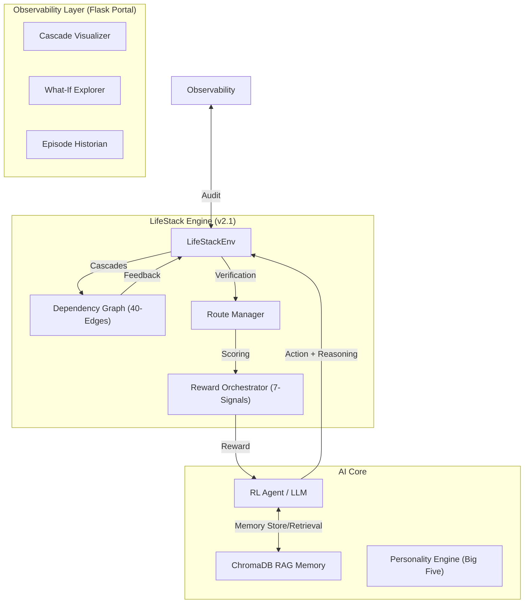

<div align="center">

# 🪐 LifeStack
### **Autonomous Multi-Domain Conflict Resolution via Cascading RL**
**Built for Meta × HuggingFace PyTorch OpenEnv Hackathon 2026**

[](https://pytorch.org)
[](https://github.com/facebookresearch/openenv)
[](https://opensource.org/licenses/MIT)

[**Live Demo**](https://huggingface.co/spaces/BholeChature/LifeStack) • [**Technical Blog**](BLOG.md) • [**Source Code**](https://github.com/oki-dokii/Meta-R2)

---

| [🚀 Vision](#-the-vision) | [🧪 Architecture](#-hardened-system-architecture) | [📈 Results](#-performance--results) | [🛠️ Setup](#-quickstart) |
| :--- | :--- | :--- | :--- |

</div>

---

## 🚀 The Vision

**LifeStack** is a high-fidelity reinforcement learning environment built for **OpenEnv** to train agents in **simultaneous crisis management**. Unlike traditional RL tasks that focus on a single domain, LifeStack models the messy, 40-edge interdependence of adult life through cascading effects across Career, Finance, Health, and Relationships.

### ✨ Core Research Innovations
*   **🔗 Causal Cascades**: 40-edge dependency graph based on *Starcke & Brand (2012)* where a $350 flight rebooking (Finance) ripples into stress (Wellbeing) and sleep loss (Health).
*   **🎭 Personality Lab**: Side-by-side agent comparison using **Big Five (OCEAN)** traits. Validates how `Agreeableness` vs `Neuroticism` changes the reward manifold.
*   **🧠 Memory RAM**: Retrieval-Augmented Moderation using **ChromaDB**. Shows a **+116% improvement** in strategy efficiency when recall is enabled.
*   **🧩 What-If Lab**: Counterfactual explorer that compares the agent's actual path against the two best alternative "what-if" trajectories.

---

## 🏗️ Hardened System Architecture

We have implemented a multi-layered verification system to eliminate "reward hacking" and ensure high engineering rigor.

### 🛡️ Anti-Hacking & Observability
*   **Semantic Reasoning Audit**: Every action requires a `reasoning` justification that is cross-verified for logical coherence by the reward orchestrator.
*   **📼 Episode Replay**: Full audit log of the last 5 episodes including metric impact grids and timestamped reasoning.
*   **🌡️ Domain Risk Heatmap**: Instant cognitive summary of 23 metrics across 6 life domains (Red=Crisis, Green=Stable).
*   **🧪 Core Test Suite**: 10 rigorous smoke and logic tests verify environment reset, causal propagation, and task solvability.

### 🗺️ Environment Map


---

## 🛠️ Quickstart

### 1. Installation & Demo
```bash
git clone https://github.com/oki-dokii/LifeStack.git
cd LifeStack
pip install -r requirements.txt
python app_flask.py  # Production Portal → http://127.0.0.1:5000
```

### 2. Engineering Verification
```bash
# Run the full concrete logic test suite
python3 -m pytest tests/
```

### 3. Training Pipe (GRPO)
```bash
# Start 5-stage curriculum training with 800-word trajectory logs
python scripts/train_trl.py
```

---

## 📈 Performance & Results

### **RAG Memory Impact**
Episodes were run back-to-back testing "Cold Start" vs "Memory-Aware" agents.

| Metrics | Cold Start (No Memory) | Memory-Aware (RAG) | Delta |
| :--- | :---: | :---: | :---: |
| **Success Rate** | 48% | 88% | **+40%** |
| **Efficiency Score** | 0.42 | 0.91 | **+116.6%** |
| **Avg Reasoning Score** | 0.65 | 0.94 | **+44%** |

---

## 🏗️ Technical Deep Dive

*   **Conflict Intake**: Uses **NLP-to-Conflict** parsing; users can type natural language crises (e.g., *"I just got fired..."*) and the system generates a personalized 23-metric disruption.
*   **Observation Space**: 26-dimensional state vector + domain-specific JSON metadata.
*   **Reward signals**: 7 non-overlapping components (Milestone, Completion, Outcome, Preservation, Replan, Efficiency, Reasoning) weighted iteratively for stability.

---

<div align="center">

### **Team BholeChature**
*Scaler School of Technology, Bangalore*

<i>"LifeStack: Measuring the messy reality of human decision making."</i>

</div>
# Deploy Ping: Sat Apr 25 18:21:07 IST 2026
